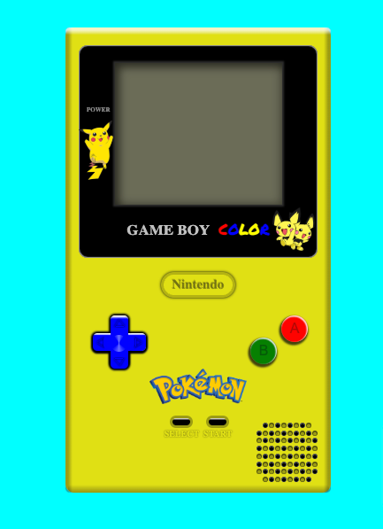

# GameBoy Pikachu Edition.

###### Adapted for 360px resolution.

## Technologies used:
- HTML
- CSS
- JAVASCRIPT

## Description:
Interactive GameBoy that connects to a Pokémon API and allows us to go through all the Pokémon in the Kanto region with an image, the type of Pokémon and the weight on the screen. 
The api I used is the following: https://pokeapi.co/

## How to use:
<ol>
    <li>Download the project in any way you choose.</li>
    <li>Open it with your favorite code editor.</li>
    <li>Open a terminal.</li>
    <li>Install the dependencies you need.</li>
    <li>Run the following command in your terminal: npm run dev.</li>
    <li>Copy the link it provides you into your browser bar.</li>
    <li>Press the A button to turn on the GameBoy.</li>
    <li>Use the right or left crossbar to go through the pokemon.</li>
    <li>To restart the GameBoy press the B button.</li>
    <li>Enjoy!</li>
</ol>

## Contribution:
If you have any suggestions or problems, don't hesitate to let me know! Thank you!! 